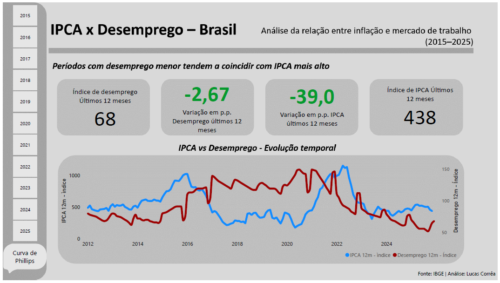
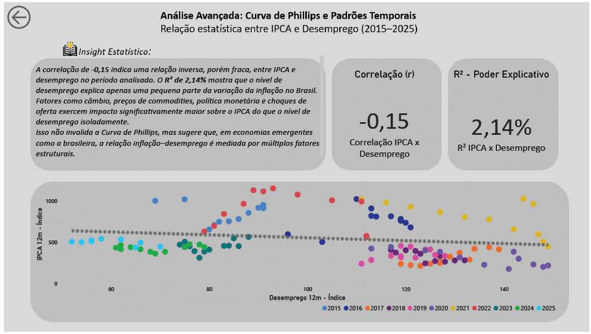

# 📊 IPCA x Desemprego – Brasil (2015-2025)

Análise da relação entre inflação oficial (IPCA) e taxa de desemprego no Brasil utilizando dados do IBGE, com foco na Curva de Phillips e interpretação estatística para economias emergentes.

---

## 🎯 Objetivo

Investigar se existe correlação significativa entre IPCA e desemprego no Brasil no período 2015-2025.

**Resultado:** Correlação fraca (-0,15) e R² de 2,14%, indicando que desemprego explica apenas uma pequena parte da variação da inflação.

---

## 🛠️ Tecnologias

- **Python**: Extração de dados via APIs do IBGE
- **Power Query (M)**: Transformação e modelagem
- **DAX**: Cálculo de KPIs
- **R**: Correlação de Pearson e R²
- **Power BI**: Visualização interativa

---

## 📊 Dashboard

### Página 1: Visão Geral

### Página 2: Curva de Phillips

---

## 📈 Principais Insights

1. **Correlação fraca (-0,15)**: Relação inversa, mas pouco significativa
2. **R² baixo (2,14%)**: Desemprego explica pouco da inflação
3. **Fatores estruturais dominam**: Câmbio, commodities e choques de oferta têm impacto maior

---

## 📚 Fontes

- [API SIDRA IBGE - IPCA](https://servicodados.ibge.gov.br/api/docs/agregados)
- [API SIDRA IBGE - PNAD Contínua](https://www.ibge.gov.br/estatisticas/sociais/trabalho/9173-pesquisa-nacional-por-amostra-de-domicilios-continua-trimestral.html)

---

## 👤 Autor

**Lucas Corrêa**  
Analista de Processos e Dados | Aspirante a Engenheiro de Dados  
📍 Rio de Janeiro, BR  

